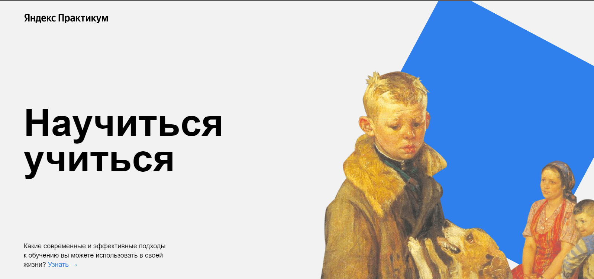

# Привет, меня зовут **Ринат** :wave:
## Научиться учиться

### Дизайн @Yandex.Practicum

___
Проект *Научиться учиться* для тех кто только начал свой путь **~~странника~~** :bowtie: в программировании. В этом проекте собраны все проблемы обучения и их решения, техники, и методы для закрепления знаний в вёрстке.:newspaper:

> Учиться тоже нужно уметь, но почему-то этому мало где учат. Что с этим делать?

### Технологии
+ BEM :goberserk:
  + Nested - файловая структура :rage:
+ Flex
+ Animation
+ iFrame
+ Git

___
### Автор
[Telegramm](https://t.me/ri_yarm)

[GitHub](https://github.com/ri-yarm)

